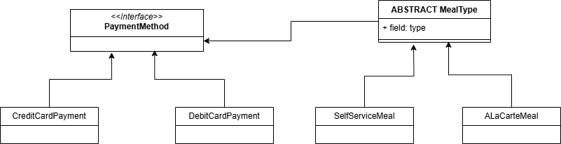
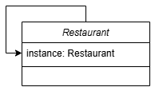
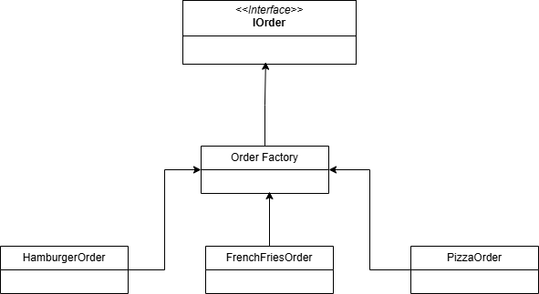

# Bridge Singleton Factory

Aplicação Java para praticar os conceitos aprendidos na disciplina de Aspectos Avançados em Engenharia de Software.

**Todos os testes estão na pasta Test.** 

# Diagramas simplifcados
## Bridge 

## Singleton

## Factory
